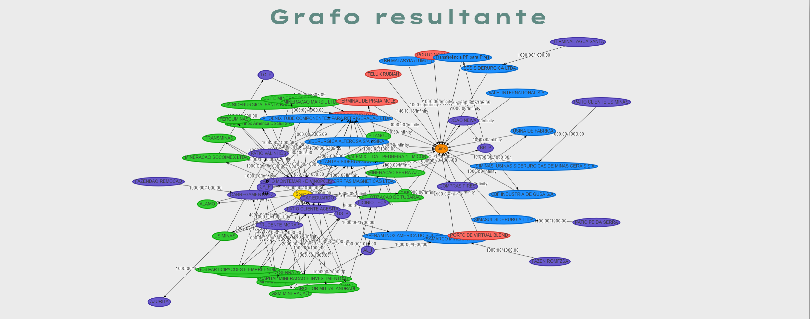
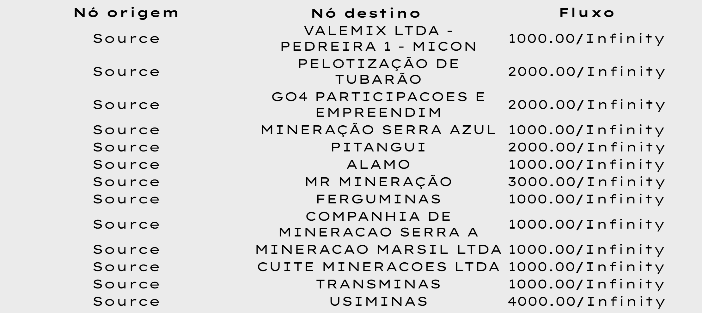
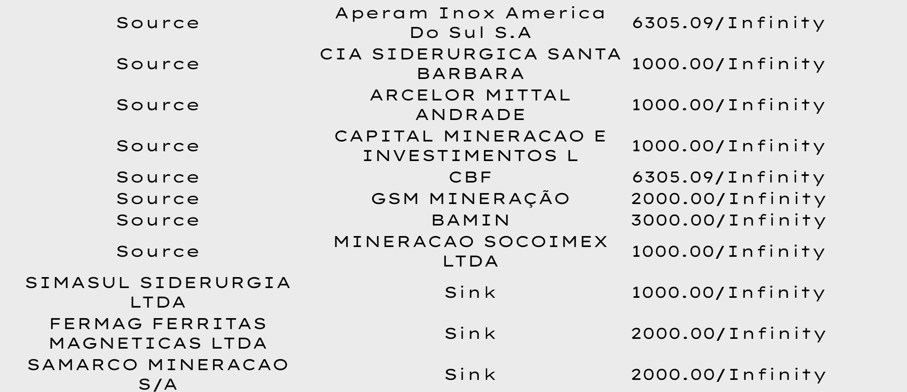
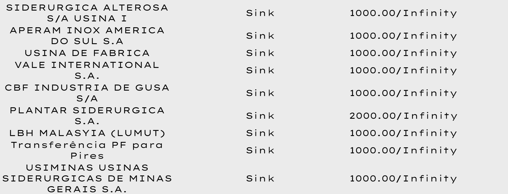
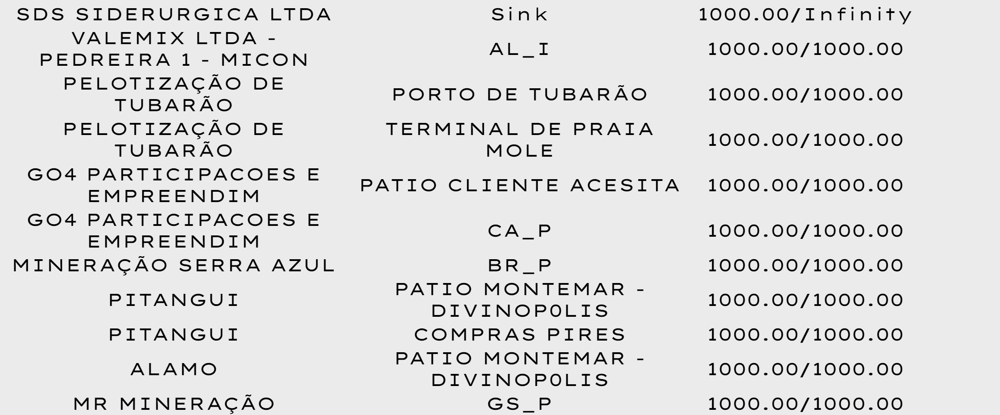
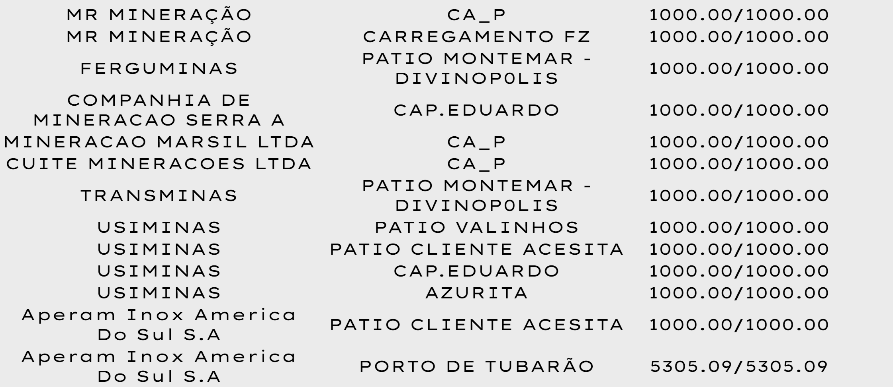
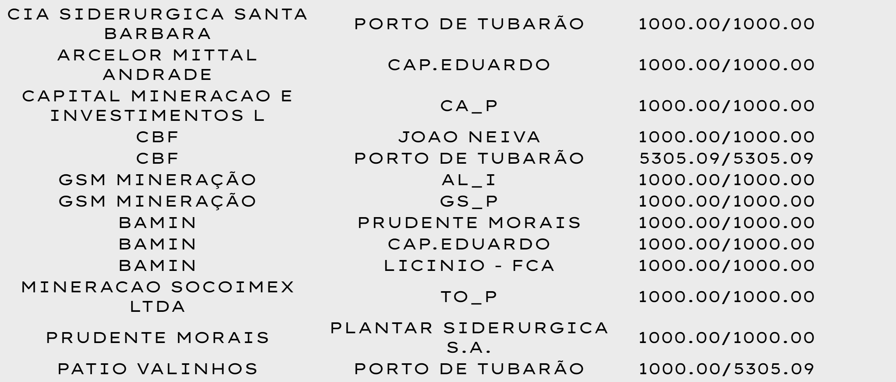
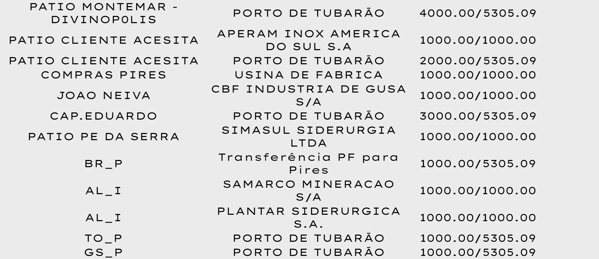
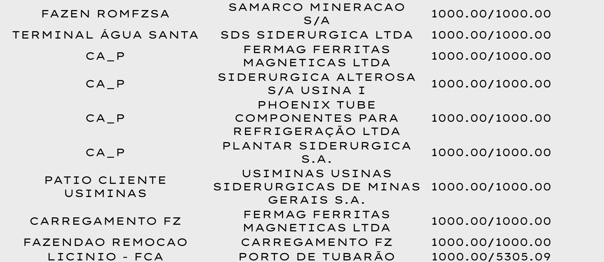

# Introdução

&emsp;&emsp;Este artigo apresenta um estudo sobre a otimização do fluxo de minério em uma grande empresa da área de mineração, a Vale, que opera diversas minas, usinas, pátios e atende a uma variedade de clientes. Nesse contexto complexo, a eficiência do transporte de minério é crucial para atender às demandas específicas dos clientes dentro de prazos definidos, respeitando as restrições operacionais e maximizando a quantidade de minérios que alcançam o destino final.

&emsp;&emsp;A busca por essa eficiência envolve um planejamento cuidadoso dos recursos de transporte disponíveis, incluindo uma variedade de meios de transporte, e a consideração da capacidade de armazenamento intermediário ao longo da cadeia logística. Essa busca destaca a necessidade de uma abordagem refinada na otimização logística, que não apenas maximize a quantidade de minério entregue, mas também melhore a utilização dos recursos e reduza os custos operacionais.

&emsp;&emsp;Nesse contexto, este trabalho propõe uma solução inovadora baseada em uma abordagem de alto desempenho que utiliza grafos, seguindo a lógica do fluxo máximo. Para alcançar o resultado esperado, são empregados os algoritmos de Ford-Fulkerson e Edmonds-Karp, que são métodos clássicos para resolver problemas de fluxo em redes. A implementação dessa solução resulta em uma plataforma web integrada, composta por backend e frontend, proporcionando uma visualização intuitiva das informações. O objetivo dessa aplicação é facilitar o planejamento e a compreensão da distribuição do fluxo de minério para atender de maneira eficiente às demandas dos clientes.

&emsp;&emsp;A relevância deste estudo para a empresa é enfatizada pela contribuição significativa que a solução proposta pode oferecer. Além de agilizar o planejamento e melhorar a eficiência logística, espera-se que ela reduza os custos operacionais, satisfaça os clientes e aumente a competitividade da empresa. Este trabalho não se limita a uma solução prática imediata, mas busca estabelecer uma base sólida para futuras melhorias e inovações no âmbito da logística da empresa.

&emsp;&emsp;É importante ressaltar que diversas pesquisas anteriores têm explorado problemáticas semelhantes à abordada neste estudo, fornecendo insights valiosos para aprimorar a eficiência do transporte de minério em ambientes complexos, como minas subterrâneas, por exemplo, como discutido no artigo "Optimization of Truck-Loader Haulage System in an Underground Mine: A Simulation Approach" de Salama e Greberg.

# Motivação

&emsp;&emsp;A distribuição eficiente de minério de ferro é uma prioridade estratégica para a Vale, uma das líderes globais no setor de mineração. O desafio enfrentado pela empresa reside na necessidade de atender às demandas dos clientes de forma rápida, eficiente e econômica, considerando as diversas características dos minérios produzidos, os diferentes modais de transporte disponíveis e as especificidades de cada cliente.

&emsp;&emsp;O problema de maximização da eficiência na distribuição de minério de ferro da Vale é complexo e multifacetado. Envolve a otimização dos recursos disponíveis na malha logística da empresa, considerando capacidades e restrições operacionais, além de garantir o atendimento às demandas dos clientes dentro dos prazos estabelecidos. É importante ressaltar que o problema completo se encaixa na categoria de problemas em que é muito custoso computacionalmente determinar uma solução ótima.

&emsp;&emsp;Resolver esse problema trará inúmeros benefícios para a Vale. Primeiramente, a maximização da eficiência na distribuição permitirá a redução de custos operacionais e a melhor utilização dos meios de transporte disponíveis. Além disso, fornecer um planejamento otimizado dos fluxos de minério, considerando as capacidades e restrições operacionais da rede logística da empresa, melhorará significativamente a tomada de decisão dos planejadores de Supply Chain.

&emsp;&emsp;Um dos benefícios mais importantes da resolução desse problema é a redução do tempo de resposta do software utilizado. Isso possibilitará a realização de um maior número de simulações e análises do que anteriormente. Assim, a empresa poderá explorar diferentes cenários e tomar decisões mais informadas e estratégicas em relação à distribuição de minério de ferro.

&emsp;&emsp;Em suma, a resolução desse problema é crucial para a Vale, pois garantirá uma distribuição mais eficiente e econômica do minério de ferro. Isso não apenas melhorará sua competitividade no mercado, mas também garantirá a satisfação contínua dos clientes.

# Materiais e metodologia

&emsp;&emsp;A metodologia adotada para resolver o problema de otimização do fluxo máximo de minério da Vale envolve uma série de etapas e ferramentas específicas. É importante ressaltar que o projeto foi modelado de forma a tratar uma versão simplificada do problema, uma vez que não será levada em conta a diversidade de produtos e os diversos horizontes de tempo. Essa simplificação permite focar nos aspectos fundamentais da otimização do fluxo de minério, tornando o problema mais gerenciável e viável para análise e resolução.

&emsp;&emsp;Esses materiais serão integrados ao longo do processo de desenvolvimento para criar uma solução abrangente e eficaz para o problema de otimização do fluxo de minério. Dentre os materiais a serem empregados, destacam-se o GitHub, uma plataforma utilizada em grupo para gerenciar o projeto, dividir tarefas e acompanhar o progresso. Esta plataforma oferece recursos de controle de versão e colaboração, permitindo que os membros compartilhem e gerenciem o código fonte de forma eficiente. Além disso, o IntelliJ, um ambiente de desenvolvimento integrado (IDE) utilizado para programação em Java, será empregado para escrever, compilar e depurar o código fonte do sistema de otimização logística.

&emsp;&emsp;Um componente essencial será o Neo4J, um sistema de gerenciamento de banco de dados de grafos utilizado para representar e manipular dados relacionados às rotas de transporte de minério. O Neo4J oferece recursos avançados para modelagem de grafos e consultas, sendo adequado para a análise e otimização de redes de transporte complexas. Além disso, serão implementados algoritmos específicos, como Ford-Fulkerson e Edmonds-Karp, para resolver o problema de otimização do fluxo de minério. A seleção desses algoritmos será feita com base nas necessidades específicas da Vale.

&emsp;&emsp;A metodologia também envolverá o desenvolvimento de uma plataforma web integrada, que permitirá a visualização intuitiva das informações sobre o fluxo de minério, incluindo rotas, tipos de transporte e tempo necessário para atender às demandas dos clientes. Essa interface de usuário será desenvolvida utilizando tecnologias web modernas, como HTML, CSS, JavaScript, React.js. Ademais, será necessário desenvolver um backend para lidar com a lógica de negócios, processamento de dados e comunicação com o banco de dados. Isso poderá ser implementado em uma linguagem de programação como Java, Python, Node.js ou .Net, dependendo dos requisitos de desempenho e integração com outras tecnologias.

&emsp;&emsp;Por fim, o frontend será a parte do sistema acessível aos usuários finais, permitindo que eles interajam com a plataforma web para visualizar e analisar os resultados da otimização logística. Essa parte do sistema será desenvolvida utilizando as tecnologias mencionadas anteriormente. Esses materiais e etapas serão combinados e integrados ao longo do processo de desenvolvimento, visando oferecer uma solução precisa e eficiente para a Vale.

# Trabalhos relacionados

&emsp;&emsp;As pesquisas relevantes fornecem um arcabouço teórico e prático essencial para o desenvolvimento do nosso estudo sobre a otimização do fluxo de minério. Primeiramente, o estudo conduzido por Pinheiro, Costa e Cotrim, "Uma Visão Computacional Teórico-Prática do Emprego da Teoria dos Grafos na Resolução de Problemas de Fluxo Máximo", explora a teoria dos grafos e a resolução de problemas de fluxo máximo, identificando o algoritmo de Ford-Fulkerson como uma ferramenta fundamental nesse contexto. Esse algoritmo, desenvolvido por Ford e Fulkerson, visa maximizar o fluxo em uma rede respeitando as capacidades de transmissão, e sua implementação prática oferece insights valiosos para a determinação do valor máximo passível de ser trafegado em uma rede. A análise teórico-prática realizada neste trabalho proporciona uma compreensão abrangente dos fundamentos da teoria dos grafos, fornecendo uma base sólida para a aplicação desses conhecimentos em nosso estudo.

&emsp;&emsp;Por sua vez, o estudo conduzido por Cardinot, Silva, Barbosa e Libotte, "Otimização do Tráfego Urbano Utilizando o Algoritmo de Ford-Fulkerson: Uma Abordagem para Reduzir Congestionamentos em Cidades", estabelece uma relação entre a otimização do fluxo no tráfego urbano e a otimização do fluxo de transporte de minérios. Ao aplicar o algoritmo de Ford-Fulkerson para determinar o fluxo máximo em uma rede de infraestrutura viária, os autores demonstram a eficácia desse algoritmo na resolução de problemas semelhantes aos que enfrentamos. A representação visual dos grafos, com o uso de cores para ilustrar diferentes situações, oferece insights valiosos para a análise e planejamento logístico em nosso contexto. Assim como no planejamento do tráfego em uma cidade, o princípio do algoritmo de Ford-Fulkerson também se aplica ao planejamento logístico de minérios, levando em conta variáveis como tempo de transporte, capacidade de estoques, meios de transporte, custos e demandas dos clientes. Essa abordagem integrativa entre a teoria e a prática nos fornece uma base sólida para o desenvolvimento de nossa proposta de solução para otimização logística.

&emsp;&emsp; Além disso, o capítulo 26.2 do livro "Algoritmos - Teoria e Prática" de Cormen, Leiserson, Rivest e Stein, fornece uma explicação detalhada sobre os algoritmos de Ford-Fulkerson e Edmonds-Karp, suas implementações e conceitos relacionados, como redes residuais e caminhos aumentadores. A compreensão desses algoritmos, através da leitura desse livro, nos permite aprimorar nossa solução e desenvolvê-la de maneira mais eficaz.  

&emsp;&emsp;Portanto, ao nos basearmos nos estudos mencionados e na leitura do livro de Cormen, estamos fortalecendo nossa pesquisa com uma base sólida de conhecimento teórico e prático, essencial para o desenvolvimento de uma solução eficiente para a otimização logística de transporte de minério.

# Algoritmos adotados para resolver o problema

&emsp;&emsp;A teoria dos grafos é uma ferramenta poderosa para resolver uma variedade de problemas em diferentes áreas, e a maximização de fluxos em redes é um desses desafios cruciais. Dois dos algoritmos mais proeminentes para abordar esse problema são o algoritmo de Ford-Fulkerson e sua variante, o algoritmo de Edmonds-Karp. Neste artigo, exploraremos o funcionamento e as razões para escolher entre esses dois algoritmos.

### Algoritmo de Ford-Fulkerson:

&emsp;&emsp;O algoritmo Ford-Fulkerson, também conhecido como algoritmo dos pseudocaminhos aumentadores, é uma técnica clássica para resolver o problema do fluxo máximo em uma rede de fluxo. Ele se baseia no conceito de aumentar o fluxo em caminhos de aumento até que não seja mais possível encontrar um caminho. Isso é feito ajustando o fluxo ao longo das arestas, garantindo que a capacidade das arestas seja respeitada.

&emsp;&emsp;O processo iterativo do algoritmo de Ford-Fulkerson começa com um fluxo inicial que respeita as capacidades das arestas, sendo a primeira iteração com um fluxo nulo. A cada iteração, o algoritmo procura um caminho aumentador, ou seja, um caminho da origem ao destino onde há capacidade residual em cada aresta. Em seguida, ele calcula a capacidade residual desse caminho e aumenta o fluxo ao longo dele pelo menor valor de capacidade residual encontrado.

### Algoritmo de Edmonds-Karp:

&emsp;&emsp;O algoritmo de Edmonds-Karp é uma variante do algoritmo Ford-Fulkerson que utiliza a busca em largura para encontrar o caminho de aumento mais curto em cada iteração. Essa escolha de método de busca proporciona uma convergência mais rápida em comparação com o Ford-Fulkerson tradicional.

&emsp;&emsp;Ao empregar a busca em largura, o algoritmo de Edmonds-Karp garante que o caminho de aumento encontrado em cada iteração seja o mais curto possível. Isso ajuda a evitar iterações desnecessárias e resulta em uma eficiência computacional aprimorada, especialmente em grafos com capacidades de arestas variadas.

### Comparação e Conclusão:

&emsp;&emsp;O algoritmo Ford-Fulkerson e o algoritmo Edmonds-Karp são algoritmos clássicos para encontrar o fluxo máximo em uma rede de fluxo. Ambos os algoritmos são baseados no conceito de caminhos aumentadores, que são caminhos na rede que permitem aumentar o fluxo de uma fonte para um sumidouro. 

&emsp;&emsp;Ambos os algoritmos, Ford-Fulkerson e Edmonds-Karp, são poderosos para resolver problemas de fluxo máximo em redes. Enquanto o Ford-Fulkerson oferece versatilidade e facilidade de implementação, o Edmonds-Karp garante uma convergência mais rápida devido à sua estratégia de busca em largura. A escolha entre eles depende das características específicas do problema em questão, como a estrutura da rede, as capacidades das arestas e as restrições de desempenho. Em resumo, a compreensão das complexidades e vantagens de cada algoritmo é crucial para selecionar a abordagem mais adequada para resolver problemas de fluxo máximo em redes.

# Resultados obtidos

&emsp;&emsp;Os resultados obtidos revelam que tanto o algoritmo Ford-Fulkerson quanto o Edmonds-Karp produziram o mesmo fluxo máximo para o produto AF40, 42610.18030769231 quilotoneladas. Esse resultado foi alcançado por meio da análise da rede de fluxo, onde os nós representam diferentes entidades e as arestas representam os caminhos possíveis para o fluxo. 

&emsp;&emsp;Matematicamente, esse resultado pode ser representado usando o conceito de grafos e fluxo, onde cada nó no grafo corresponde a uma entidade, como fontes, destinos ou intermediários, e as arestas entre os nós representam as conexões ou rotas possíveis para o fluxo, com a capacidade de cada aresta indicando o quanto de fluxo pode passar por ela.

&emsp;&emsp;Ambos os algoritmos trabalham para otimizar esse fluxo, encontrando o caminho de aumento que permite aumentar o fluxo da fonte para o destino. No caso do algoritmo de Edmonds-Karp, ele utiliza a busca em largura para encontrar o caminho de aumento mais curto em cada iteração, garantindo uma convergência mais rápida.

&emsp;&emsp;Assim, os resultados obtidos mostram que, independentemente do algoritmo utilizado, o fluxo máximo na rede foi determinado como 42610.18030769231 quilotoneladas. Isso significa que, considerando as capacidades das rotas disponíveis e as demandas das entidades, essa é a quantidade máxima de recursos que podem ser transportados da fonte para o destino na rede dada.

&emsp;&emsp;Além disso, é válido ressaltar que apenas o produto AF40 foi levado em consideração para o desenvolvimento. Sendo assim, o grafo resultante e os valores dos fluxos máximos passados pelas arestas serão apresentados nas imagens a seguir:

Figura 1 - Grafo gerado pela solução

Fonte: Material produzido pelos autores (2024)

 Tabela de valores dos fluxos gerados pela solução

Fonte: Material produzido pelos autores (2024)

&emsp;&emsp;Ademais, a complexidade dos algoritmos utilizados consistem em $(O(V + E))$ no melhor caso e $(O(f \cdot E))$ no caso médio para o Ford-Fulkerson e $O(VE^2)$ para Edmonds-Karp.

&emsp;&emsp;Em resumo, os resultados obtidos demonstram a eficácia tanto do algoritmo Ford-Fulkerson quanto do algoritmo Edmonds-Karp na resolução do problema de maximização de fluxo em redes, fornecendo uma solução consistente e confiável para o problema de planejamento do fluxo de minério da Vale. Isso permite aos usuários obterem resultados de maneira mais rápida e tomar melhores decisões para atender às necessidades de seus clientes. 

# Conclusão

&emsp;&emsp;Neste estudo, buscamos desenvolver uma solução eficaz para otimizar o fluxo de minério, visando atender às demandas específicas dos clientes da Vale, uma das principais empresas do setor de mineração. Ao explorar e comparar os algoritmos de Ford-Fulkerson e Edmonds-Karp, constatamos sua eficácia na determinação do fluxo máximo em uma rede. Os resultados obtidos foram consistentes, independentemente da abordagem escolhida, fornecendo uma base sólida para a implementação prática desses algoritmos em cenários reais de logística de transporte de minério.

&emsp;&emsp;A implementação prática dos algoritmos de Ford-Fulkerson e Edmonds-Karp, integrada a uma plataforma web interativa, revelou-se uma ferramenta valiosa para planejadores logísticos, proporcionando uma visão clara e intuitiva do fluxo de minério ao longo da rede de transporte. Isso não apenas facilita o planejamento logístico, mas também contribui para a maximização da eficiência operacional da empresa.

&emsp;&emsp;Olhando para o futuro, sugerimos que trabalhos subsequentes explorem ainda mais a aplicação de técnicas avançadas de otimização, como algoritmos genéticos ou de aprendizado de máquina, para lidar com problemas mais complexos de distribuição de minério. Além disso, é fundamental adaptar os algoritmos para incluir outras variáveis relevantes, como tempo, clima, congestionamento e manutenção nas rotas de transporte, bem como estoques de produtos, para garantir a precisão e a eficiência dos modelos de otimização.

&emsp;&emsp;Em última análise, este estudo estabelece uma base sólida para futuras pesquisas e inovações no campo da logística de transporte de minérios, contribuindo para a melhoria contínua da eficiência operacional e competitividade das empresas do setor.

# Referências Bibliográficas

Salama, Abubakary J.; Greberg, Jenny. **Optimization of Truck-Loader Haulage System in an Underground Mine: A Simulation Approach using SimMine.** Luleå University of Technology, 2012. Disponível em: https://www.diva-portal.org/smash/get/diva2:1011835/FULLTEXT01.pdf. Acesso em: 20 de fevereiro de 2024.

Pinheiro, W. S. S.; Costa, C. E. P.; Cotrim, R. A. **Uma Visão Computacional Teórico-Prática do Emprego da Teoria dos Grafos na Resolução de Problemas de Fluxo Máximo.** Centro Universitário Jorge Amado (Unijorge) – Salvador – BA – Brasil, 2023. Disponível em: https://transformauj.com.br/wp-content/uploads/2023/06/04.-Uma-visao-computacional-teorico-pratica-do-emprego-da-teoria-dos-grafos-na-resolucao-de-problemas-de-fluxo-maximo.pdf. Acesso em: 05 de março de 2024.

Cardinot, D. A.; Silva, T. B.; Barbosa, H. M.; Libotte, G. B. **Otimização do Tráfego Urbano Utilizando o Algoritmo de Ford-Fulkerson: Uma Abordagem para Reduzir Congestionamentos em Cidades.** Universidade do Estado do Rio de Janeiro, Instituto Politécnico - Nova Friburgo, RJ, Brasil, 2024. Disponível em: https://periodicos.unb.br/index.php/ripe/article/view/52315/39395. Acesso em: 05 de março de 2024.

Feofiloff, P. **Algoritmo de Ford-Fulkerson.** IME - USP, 2019. Disponível em:
https://www.ime.usp.br/~pf/algoritmos_para_grafos/aulas/flow-FF.html. Acesso em: 26 de março de 2024.

Cormen, T; Leiserson, C; Rivest R; Stein C. **Algoritmos - Teoria e Prática.** São Paulo: GEN LTC, 2012. Disponível em: https://integrada.minhabiblioteca.com.br/books/9788595158092. Acesso em: 08 de abril de 2024.