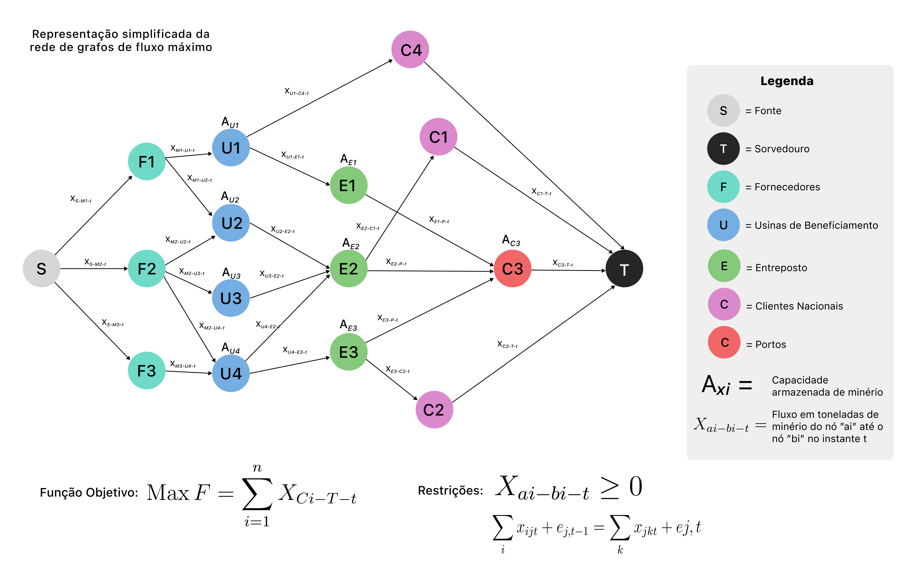
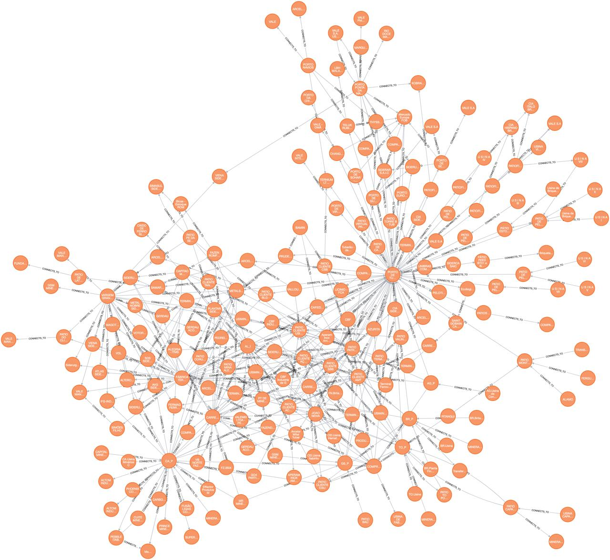
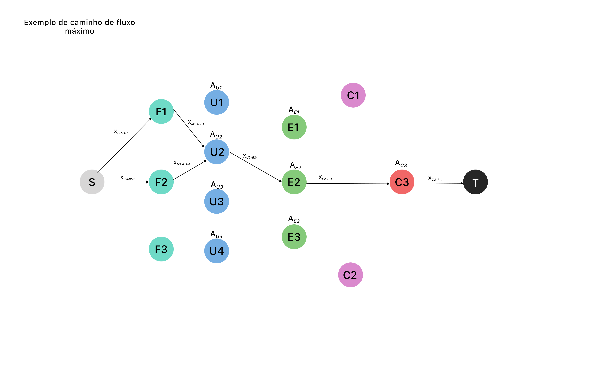

# Entendimento do contexto do problema: modelagem e representação

### Maximização do Fluxo de Minério:
&emsp;&emsp;O objetivo central deste projeto é garantir que o minério produzido pelas minas da Vale seja entregue aos clientes de forma eficiente trazendo a visão de temporal do transporte, respeitando as regras de fluxo máximo. Isso implica em maximizar a quantidade de minério transportado ao longo da cadeia logística, desde as minas até os clientes finais. Esse esforço visa otimizar a utilização dos recursos disponíveis, garantindo ao mesmo tempo que as demandas dos clientes sejam atendidas de forma satisfatória.

### Meios de Transporte:
&emsp;&emsp;A variedade de meios de transporte disponíveis oferece opções diversificadas para movimentar o minério ao longo da cadeia logística. Os caminhões são úteis para o transporte terrestre em distâncias relativamente curtas ou em áreas de difícil acesso. As correias transportadoras são ideais para o transporte contínuo de grandes volumes de minério em distâncias moderadas. Os minerodutos, por sua vez, oferecem uma solução eficiente para o transporte de minério em grande escala, especialmente em áreas onde a topografia é desafiadora. As ferrovias e os navios são fundamentais para o transporte de longa distância, conectando as minas aos portos e aos clientes finais em diferentes regiões do mundo.

### Armazenamento Intermediário:
&emsp;&emsp;A capacidade de armazenamento intermediário desempenha um papel crucial na otimização da logística. Ao permitir o armazenamento temporário do minério em locais estratégicos ao longo da cadeia de transporte, é possível suavizar as flutuações na produção e na demanda, além de facilitar o gerenciamento eficiente dos fluxos de materiais. Isso pode ajudar a evitar gargalos na cadeia logística e a garantir uma distribuição mais uniforme do minério, contribuindo para uma operação mais eficiente e confiável.

### Dados Relevantes:
&emsp;&emsp;Os dados disponíveis para este projeto incluem uma variedade de informações essenciais para o planejamento e execução da logística de transporte de minério. Isso inclui não apenas detalhes sobre as minas, como suas localizações geográficas e capacidades de produção, mas também informações sobre os diferentes meios de transporte disponíveis, seus custos associados, capacidades máximas e lead times. Além disso, é fundamental ter dados sobre os clientes, incluindo suas localizações e as quantidades específicas de minério solicitadas. Os locais de armazenamento intermediário também devem ser incluídos nos dados, juntamente com suas capacidades máximas e localizações estratégicas ao longo da cadeia logística.

&emsp;&emsp;A figura abaixo representa de maneira simplificada a modelagem matemática utilizada para representar a logística da Vale. A partir de uma rede de grafos, o algoritmo desenvolvido definirá qual é a distribuição de fluxo ideal a fim de maximizar as funções objetivo, estando sempre de acordo com as decisões.

Figura 1 - Representação visual da rede de grafos

Fonte: Material produzido pelos autores (2024)

Figura 2 - Representação visual da rede de grafos da Vale

Fonte: Material produzido pelos autores (2024)

&emsp;&emsp;Nas figuras, estão destacadas diferentes categorias de nós com diferentes capacidades e funções. Os fornecedores fornecem material intermediário para as usinas de beneficiamento que, por sua vez, produzem os minérios que serão comercializados com os clientes. Os entrepostos e as usinas são nós que possuem a característica de armazenamento, ou seja, eles são capazes de estocar parte dos minérios que não foram escoados durante o processo de venda para os clientes e durante o processo de envio para o porto. Um dos desafios do nosso algorítimo será exatamente distribuir entre as unidades de armazenamento, de forma eficiente, os minérios que não tiveram destino. Os clientes também representam nós de extrema importância para a solução, eles impõem restrições no grafo ao solicitar quantidades específicas de diferentes minérios para a empresa. Por esse motivo, um dos principais objetivos da solução é fazer com que as demandas de todos os clientes sejam atingidas com o menor desperdício de recursos possível.

&emsp;&emsp;Conforme ilustrado, a solução se baseará em diversos elementos interligados de forma coesa. A essência desse projeto reside na aplicação da modelagem em grafos, na implementação do software desenvolvido especificamente para esta finalidade, e na meticulosa consideração de fatores como capacidades de produção, lead times, demandas dos clientes e restrições operacionais. Vamos explorar mais detalhadamente cada um desses pontos para obter uma visão abrangente do processo:

1. **Modelagem em Grafos:**
   - Um grafo é uma estrutura matemática que consiste em nós (ou vértices) conectados por arestas (ou arcos). No contexto logístico da distribuição de minério, os nós podem representar as minas, os locais de armazenamento, os clientes e os pontos de transporte, enquanto as arestas representam as rotas entre esses locais.
   - A modelagem em grafos permite representar visualmente a rede logística da Vale, facilitando a análise e a otimização dos fluxos de minério. Algoritmos de grafos podem ser aplicados para resolver problemas de roteamento e fluxo máximo, contribuindo para a maximização da eficiência na distribuição de minério.

2. **Implementação do Software:**
   - O software deve ser desenvolvido com base em algoritmos eficientes de otimização de fluxo em grafos. Algoritmos como o algoritmo de Ford-Fulkerson ou Push-Relabel (ou Preflow-Push) para fluxo máximo.
   - A interface do usuário deve ser intuitiva e amigável para que os operadores possam inserir facilmente os dados de entrada, como capacidades de produção, demandas dos clientes e características dos meios de transporte.
   - O software deve ser capaz de lidar com atualizações dinâmicas nos dados, como mudanças nas demandas dos clientes, capacidades de produção das minas ou interrupções nos meios de transporte.

3. **Considerações Específicas:**
   - Capacidades de produção: O software deve considerar as capacidades de produção de cada usina de beneficiamento de minério, garantindo que a distribuição de minério não exceda essas capacidades.
   - Lead times: Os lead times dos diferentes meios de transporte devem ser levados em conta para garantir a entrega oportuna do minério aos clientes.
   - Demandas dos clientes: As demandas específicas de cada cliente devem ser atendidas, priorizando a distribuição de minério para maximizar a satisfação do cliente e evitar penalidades por atrasos.
   - Restrições operacionais: O software deve considerar as restrições operacionais, como limitações de capacidade nos meios de transporte, disponibilidade de armazenamento e requisitos regulatórios.

4. **Escopo Inicial:**
   - Iniciar o desenvolvimento do software com foco na região Sudeste da Vale e no atendimento das demandas dos clientes até o Porto de Tubarão é uma abordagem prudente, permitindo uma implementação gradual e aprimoramentos iterativos do sistema.
   - Uma vez que o software esteja operacional e validado na região Sudeste, pode-se considerar a expansão para outras regiões e portos, ampliando o alcance e os benefícios da solução para toda a operação logística da Vale.

Ao considerar esses pontos, o projeto estará mais bem elaborado e pronto para ser implementado, fornecendo uma solução robusta e eficiente para a distribuição de minério da Vale.

### Objetivos:
$$
Max F = \sum_{i=1}^{n} X_{C_i - T - t}
$$

- Maximizar a chegada de minérios para os clientes.
- Maximizar a quantidade de carga em cada transporte.
- Encontrar caminhos que consigam atender as demandas dos clientes sem ultrapassar as capacidades de armazenamento de cada nó. 
- Atingir um tempo de execução menor do que 90 minutos no teste com os dados reais da empresa.

### Restrições:
- $X_{ai - bi - t} > 0$
- $\sum_{i} x_{ijt} + e_{j,t} = \sum_{k} x_{jkt} + e_{j,t}$ 
- Quantidades solicitadas pelos clientes.
- Capacidade de armazenamento em cada nó.
- Quantidade de material produzido por cada mina.
- Tempo da entrega do cliente não pode ser excedido.

### Decisões:
- $X_{ijt} =$ Fluxo transportado (em toneladas) do nó "i" para o nó "j" e "t" o tempo.
- Não é necessário que o nó Porto seja acessado, é possível enviar ao cliente por meio das usinas de beneficiamento e dos entrepostos.
- Mina que fornece - decisão baseada em tempo e capacidade de fornecimento.

### Permissões lógicas:
- Um mesmo caminho pode ser utilizado para transportar um determinado minério para mais de um cliente.
- Mais de uma mina pode ser utilizada para fornecer a quantidade necessária para determinado cliente. 
- Mais de um caminho pode ser utilizado para transportar determinada quantidade de material de uma ou mais minas para um ou mais clientes.
- É possível transportar minerios diferentes pelo mesmo nó e aresta.

### Limitações:
- Capacidade de Produção das Minas.
- Tempo de Execução do Algoritmo.
- Disponibilidade de Armazenamento.
- Tempo de Viagem.

## Representação do Fluxo do Grafo
&emsp;&emsp;A representação do fluxo em um grafo desempenha um papel fundamental na compreensão e otimização dos processos de transporte dos minérios produzidos pela Vale. Em um contexto operacional, a visualização e análise do fluxo de minério ao longo das arestas do grafo permitem uma compreensão abrangente de como a carga é direcionada do nó de origem até o destino final.

&emsp;&emsp;Essa representação não apenas fornece insights sobre a trajetória do fluxo, mas também permite a identificação de gargalos, a alocação eficiente de recursos e a maximização da capacidade de transporte. Ao modelar o fluxo como um problema de fluxo máximo em um grafo, é possível aplicar algoritmos especializados para determinar a quantidade máxima de minério que pode ser transportada através da rede, considerando limitações de capacidade em cada aresta.

Figura 3 - Representação visual de um exemplo de Fluxo Máximo

Fonte: Material produzido pelos autores (2024)

&emsp;&emsp;O fluxo descrito envolve um processo estruturado e coordenado, onde as usinas de beneficiamento atuam como receptores primários de suprimentos provenientes dos fornecedores. Estas instalações, munidas de recursos adequados, assumem o papel de distribuidores dos minérios, encaminhando-os para os entrepostos designados. No âmbito dos entrepostos, ocorre uma etapa crucial de alocação, onde os minérios são direcionados especificamente ao Cliente 3, identificado como o porto de Tubarão, responsável por atender as demandas do cliente final. Este fluxo delineia uma cadeia logística intricada, onde cada estágio é meticulosamente coordenado para garantir uma entrega eficiente e pontual ao destino final.

## Seleção de algoritmos:

&emsp;&emsp;Os algoritmos escolhidos para abordar o problema da maximização do fluxo de minério de ferro da Vale são o Algoritmo de Ford-Fulkerson e o Algoritmo de Edmonds-Karp. Ambos os algoritmos são altamente relevantes para resolver problemas de fluxo em redes e oferecem abordagens distintas para a resolução do problema em questão.

&emsp;&emsp;O Algoritmo de Ford-Fulkerson é uma escolha adequada devido à sua capacidade de encontrar o fluxo máximo em redes, o que se alinha diretamente com o objetivo de maximizar a eficiência na distribuição de minério. Esse algoritmo utiliza o conceito de caminhos aumentantes para iterativamente aumentar o fluxo na rede até que não seja mais possível encontrar um caminho aumentante.

&emsp;&emsp;O Algoritmo de Edmonds-Karp, uma variante do Ford-Fulkerson, é outra escolha relevante devido à sua eficiência em encontrar o fluxo máximo em redes com capacidades inteiras. Ele utiliza a busca em largura para encontrar o caminho aumentante mais curto em cada iteração, tornando-o mais eficiente em muitos casos práticos.

### Vantagens e Desvantagens:

#### Algoritmo de Ford-Fulkerson:

Vantagens:
  - Simplicidade conceitual: O algoritmo é mais simples de entender e implementar.
  - Flexibilidade: Pode ser adaptado para lidar com diferentes tipos de redes e restrições.
    
Desvantagens:
  - Pode não convergir em tempo polinomial em certos casos, como quando os valores das capacidades são números reais.
  - Pode ser ineficiente em redes grandes e densas devido à sua abordagem de busca de caminhos aumentantes.

#### Algoritmo de Edmonds-Karp:

Vantagens:
  - Eficiência: Em muitos casos, é mais eficiente do que o Ford-Fulkerson devido à sua abordagem de busca em largura.
  - Garantia de convergência em tempo polinomial: Sempre converge para o resultado ótimo em tempo polinomial.
    
Desvantagens:
  - Pode ser menos eficiente em redes com capacidades reais devido à necessidade de transformá-las em capacidades inteiras.
  - A complexidade de implementação pode ser um pouco maior do que a do Ford-Fulkerson devido à busca em largura.

&emsp;&emsp;Ambos os algoritmos oferecem vantagens significativas para resolver o problema em questão, com o Algoritmo de Edmonds-Karp destacando-se pela sua eficiência em muitos casos práticos, enquanto o Algoritmo de Ford-Fulkerson é mais simples e flexível em certos casos.

### Referências:

&emsp;&emsp;Brilliant. **Ford-Fulkerson Algorithm**. Disponível em: https://brilliant.org/wiki/ford-fulkerson-algorithm/#:~:text=The%20Ford%2DFulkerson%20algorithm%20is,data%20through%20a%20computer%20network. Acesso em: 20 fev. 2024.

&emsp;&emsp;cp-algorithms.com. **Push-relabel maximum flow algorithm**. Disponível em: https://cp-algorithms.com/graph/push-relabel.html. Acesso em: 20 fev. 2024.

&emsp;&emsp;CHANDRAN, B. G.; HOCHBAUM, D. S. **A computational study of the pseudoflow and push-relabel algorithms for the maximum flow problem**. Operations research, v. 57, n. 2, p. 358–376, 2009.

&emsp;&emsp;JIANG, Z.; HU, X.; GAO, S. **A parallel ford-Fulkerson algorithm for maximum flow problem**. Disponível em: <http://worldcomp-proceedings.com/proc/p2013/PDP3767.pdf>. Acesso em: 29 fev. 2024.

&emsp;&emsp;KOVALEV, K. E.; NOVICHIKHIN, A. V. **Ford-Fulkerson algorithm refinement for the cooperation effectiveness increase of intensive and low-density lines**. Journal of physics. Conference series, v. 2131, n. 3, p. 032008, 2021.
