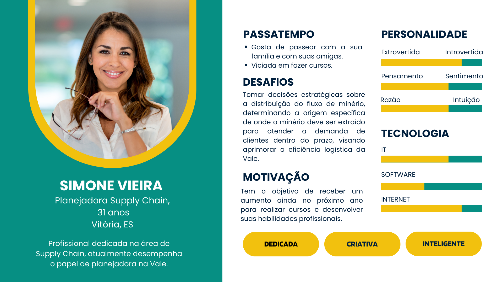

# Entendimento da experiência do usuário

## Persona

&emsp;&emsp;De acordo com Siqueira (2022), uma Persona é uma construção fictícia que representa o cliente ideal para um projeto específico. Essas personas são elaboradas com base em dados reais sobre o comportamento e as características demográficas dos clientes, proporcionando à equipe uma melhor compreensão das necessidades, preocupações e objetivos dos diversos perfis de usuários. Cada Persona apresenta uma história pessoal, motivações, objetivos, desafios e preocupações que são relevantes para o contexto do projeto. Essa abordagem permite uma compreensão mais aprofundada do público-alvo e suas necessidades, orientando efetivamente o desenvolvimento do projeto.

&emsp;&emsp;Sendo assim, apresentaremos a persona que está relacionada ao problema da performance logística na distribuição de minério da Vale.

Figura 1 - Persona

Fonte: Material produzido pelos autores (2024)

&emsp;&emsp;A Persona é a Simone Vieira, de 31 anos, que mora em Vitória, no Espírito Santo e é planejadora de Supply Chain da Vale há 5 anos.

#### Background Profissional:

&emsp;&emsp;Simone Vieira é uma profissional dedicada e experiente na área de Supply Chain, atualmente desempenhando o papel crucial de planejadora na Vale.

#### Dor:

&emsp;&emsp;Não conseguir planejar a logística para o fluxo de minério em cada malha, respeitando as restrições operacionais, para atender as demandas dos clientes de maneira mais eficiente e em um determinado tempo. Sendo assim, ela busca uma abordagem mais ágil, intuitiva e visual para otimizar esse processo.

#### Desafio Profissional:

&emsp;&emsp;Simone enfrenta o desafio de aprimorar a performance logística na distribuição de minério, uma tarefa vital para garantir a eficiência operacional da Vale. Com a crescente demanda global por minério, a pressão para otimizar os processos logísticos tornou-se ainda mais crucial. Simone é encarregada de encontrar soluções inovadoras e estratégias para garantir que o transporte e a distribuição do minério sejam realizados de maneira mais eficiente, econômica e sustentável.

#### Metas e Objetivos:

- Aumentar a eficiência: Simone visa identificar e implementar melhorias significativas nos processos de logística, desde a extração do minério até a entrega aos clientes finais, reduzindo os tempos de ciclo e custos operacionais.

- Deixar os clientes satisfeitos: Simone visa planejar o fluxo de minério em cada ponto da malha de maneira a atender as demandas dos clientes da melhor maneira possível, respeitando todas as restrições operacionais.

#### Abordagem Colaborativa:

&emsp;&emsp;Ela reconhece a importância da colaboração, por isso trabalha com equipes de diferentes áreas, como produção, transporte, tecnologia da informação e sustentabilidade, para garantir eficiência na otimização da logística na distribuição de minérios da Vale.

#### Motivação:

&emsp;&emsp;Simone adora desenvolver suas competências profissionais e socioemocionais, mas infelizmente não possui condições para pagar todos os cursos que almeja fazer. Sendo assim, ela acredita que melhorando a logística de distribuição da Vale, a qual aumentará a eficiência operacional e irá satisfazer os seus clientes, ela conseguirá receber um aumento salarial.  

#### Características Pessoais:

&emsp;&emsp;Simone é extrovertida e gosta sempre de pensar antes de agir, indo sempre de acordo com a razão. Além disso, é dedicada, colaborativa, criativa, responsável, muito inteligente e adora inovar. 

#### Passatempo:

&emsp;&emsp;Gosta de passear com a sua família e com as suas amigas. Como também, adora fazer diferentes tipos de cursos.

#### Sonho: 

&emsp;&emsp;Simone sonha em viajar por todo o mundo, conhecer diferentes pessoas e culturas.

## User Stories

&emsp;&emsp;Uma user story, ou história do usuário, é uma técnica utilizada no desenvolvimento de software para descrever uma funcionalidade do ponto de vista do usuário final. Geralmente, é uma frase simples e direta que descreve o que o usuário precisa fazer e por quê. Essas histórias são frequentemente escritas em linguagem natural e seguem um formato padrão, como: "Como [usuário], eu quero [funcionalidade] para que [razão]".

&emsp;&emsp;A importância das user stories reside na sua capacidade de manter o foco no usuário durante todo o processo de desenvolvimento de software. Elas ajudam a equipe a entender as necessidades dos usuários e a criar produtos que atendam a essas necessidades de forma eficaz. Além disso, as user stories são ferramentas flexíveis que permitem uma comunicação clara e contínua entre os membros da equipe e os stakeholders, facilitando a priorização de tarefas e a entrega incremental de valor ao cliente. Em resumo, as user stories são fundamentais para garantir que o software desenvolvido atenda às expectativas do usuário final e gere valor para o negócio.

#### User Stories do projeto:

- Como planejadora da Vale, eu quero conseguir maximizar o fluxo de deslocamento dos minérios, para aumentar a eficiência logística. 

- Como planejadora da Vale, eu quero atender as demandas dos clientes de uma maneira mais eficiente, para deixá-los satisfeitos.

- Como planejadora da Vale, eu quero uma plataforma de planejamento logístico, que seja visual e intuitiva e que me permita mapear o fluxo de minério, para que eu possa otimizar o processo de distribuição.
 
- Como planejadora da Vale, eu quero minimizar os custos de transporte, para reduzir os custos operacionais da empresa e melhorar sua competitividade no mercado.

- Como planejadora da Vale, eu quero uma solução visual que permita carregar rapidamente os dados da empresa, para que eu possa definir o fluxo de minérios em cada malha em menos de 90 minutos. 

- Como planejadora da Vale, eu quero maximizar a quantidade de carga em cada transporte, para que os minérios sejam entregues mais rápido aos clientes.

- Como planejadora da Vale, eu quero conseguir planejar a origem dos minérios, a quantidade a ser transportada, os modais e rotas ideais, para aumentar a eficiência logística e garantir entregas mais rápidas ao cliente final, considerando todas as restrições operacionais.

- Como planejadora da Vale, eu quero conseguir definir os locais adequados para estocar o minério em casos de excesso de carga, para garantir que a produção não seja prejudicada.

## Referências

&emsp;&emsp; Siqueira, André. **Persona: o que é, como definir e por que criar uma para sua empresa**. Disponível em https://resultadosdigitais.com.br/marketing/persona-o-que-e/#:~:text=O%20que%20%C3%A9%20persona%3F,%2C%20objetivos%2C%20desafios%20e%20preocupa%C3%A7%C3%B5es. Acesso em: 08 de fevereiro de 2024.
