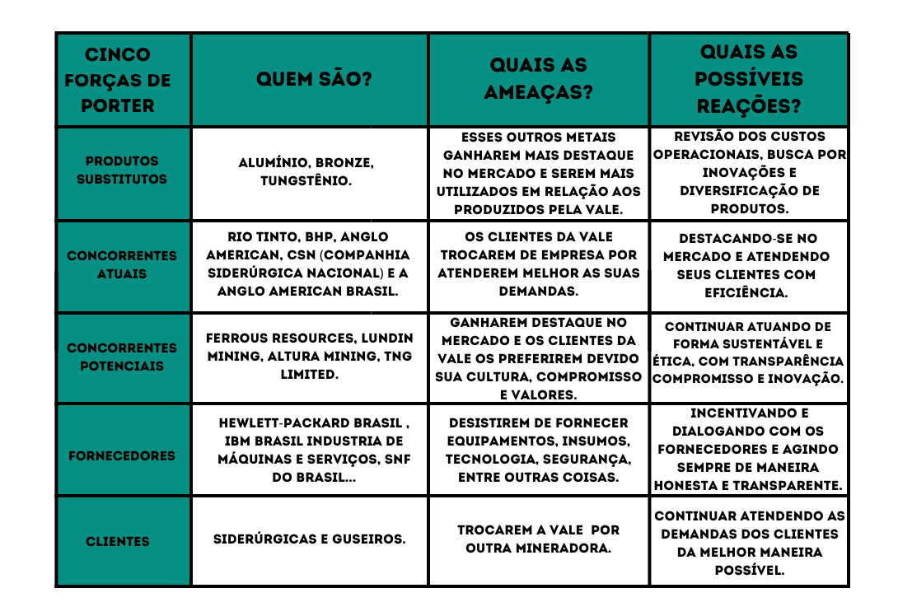
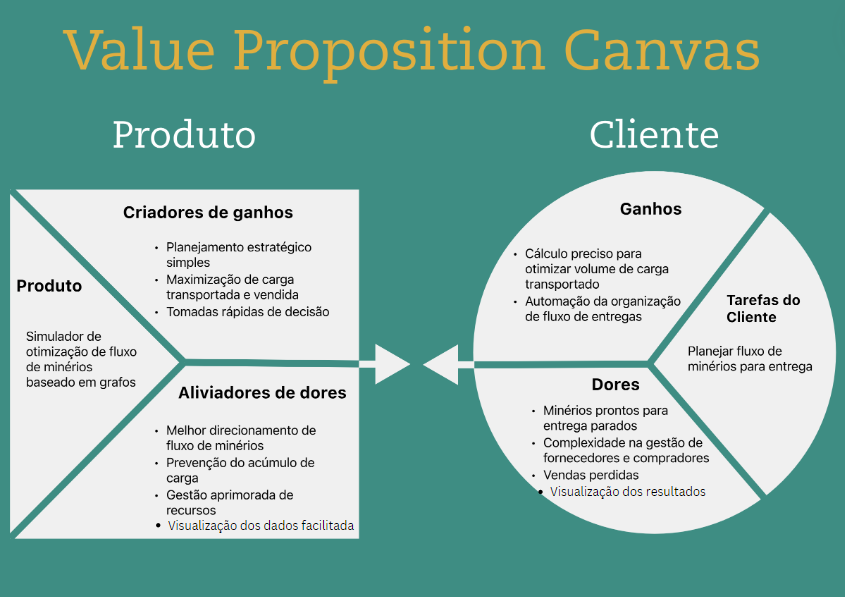
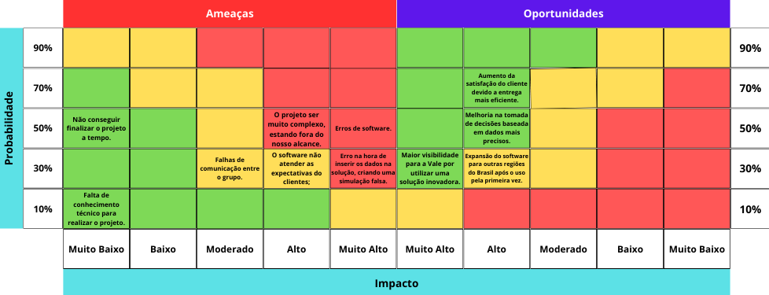

# Entendimento de negócio

## Descrição da solução

### Problema:

  &emsp;&emsp;O problema a ser resolvido é a maximização da eficiência na distribuição de minério de ferro da Vale aos clientes, considerando as diferentes características físico-químicas do minério produzido em diversas minas, as capacidades e os lead times dos diversos tipos de transporte e as demandas específicas de cada cliente. O desafio reside em planejar os fluxos de minério de forma a atender as demandas dos clientes da maneira mais eficiente possível, respeitando todas as restrições operacionais e otimizando os recursos disponíveis na malha logística.

### Solução proposta:

  &emsp;&emsp;A solução proposta é o desenvolvimento de um software que utilize modelagem em grafos para planejar os fluxos de minério, otimizando a distribuição dos recursos disponíveis na malha logística da Vale. Este software receberá como entrada as capacidades de produção de cada usina de beneficiamento, as capacidades e lead times dos diferentes transportes e as demandas dos clientes, e gerará como saída os fluxos de minério que atenderão cada cliente com seu respectivo tipo de transporte. O software inicialmente se concentrará na região Sudeste da Vale, atendendo às demandas dos clientes até o Porto de Tubarão.

### Utilização da solução:

  &emsp;&emsp;A solução será utilizada pelos planejadores de Supply Chain da Vale para realizar o planejamento dos fluxos de minério de ferro. Os usuários deverão inserir os dados de entrada necessários no software, como capacidades de produção de cada usina, demandas dos clientes e características dos meios de transporte, tendo em vista que cada rota é feita por um tipo diferente de transporte. O software então executará uma simulação visando a maximização do fluxo de minérios dentro da rede de grafos fornecida pelo planejador, indicando quais minas devem fornecer minério para atender às demandas dos clientes, utilizando os transportes disponíveis.

### Benefícios:

  &emsp;&emsp;A solução proposta trará diversos benefícios para a Vale, incluindo:
  
- Maximização da eficiência na distribuição de minério de ferro, garantindo que as demandas dos clientes sejam atendidas de forma mais eficiente possível;
- Otimização dos recursos disponíveis na malha logística, reduzindo custos operacionais e melhorando a utilização dos meios de transporte;
- Melhoria na tomada de decisão dos planejadores de Supply Chain, fornecendo um planejamento otimizado dos fluxos de minério que leva em conta as capacidades e restrições operacionais da rede logística da Vale;
- Redução do tempo de resposta do software atual, possibilitando a realização de um maior número de simulações do que anteriormente.

### Avaliação da solução:

  &emsp;&emsp;O critério de sucesso será a eficácia da solução em maximizar o atendimento às demandas dos clientes da Vale, respeitando todas as restrições operacionais e otimizando a utilização dos recursos disponíveis na malha logística. Uma das medidas utilizadas para avaliar o sucesso da solução será a comparação entre os resultados obtidos pelo software e os resultados alcançados pela solução atual da empresa, utilizando dados reais para validar a eficácia e a precisão da solução desenvolvida. Além disso, outra medida que será utilizada para avaliar a solução proposta será o tempo de resposta do software, tendo em vista que atualmente o tempo de processamento da solução da Vale gira em torno de 90 minutos, e o software tem o objetivo de diminuir esse tempo.

## Contexto da Indústria

&emsp;&emsp;O modelo das Cinco Forças de Porter, elaborado por Michael E. Porter, é um framework destinado a analisar as dinâmicas competitivas que impulsionam um setor de mercado específico. Essas forças, ao proporcionarem uma visão estratégica, têm o propósito de guiar decisões empresariais informadas. As cinco forças abordadas são: a ameaça de produtos substitutos, a rivalidade entre os concorrentes, a ameaça de entrada de novos concorrentes, o poder de negociação dos fornecedores e o poder de negociação dos clientes.

Figura 1 - Cinco Forças de Porter

Fonte: Material produzido pelos autores (2024)

&emsp;&emsp;Sendo assim, após um entendimento inicial sobre as Cinco Forças de Porter, prosseguiremos com uma análise mais aprofundada de cada uma delas, visando oferecer insights cruciais para a colocação estratégica do negócio em meio à concorrência e ao ambiente de mercado em constante evolução.

### Produtos Substitutos:

- Quais são: Alumínio, bronze, tungstênio.

- Ameaças: Há a possibilidade de esses metais ganharem mais destaque no mercado e serem mais amplamente utilizados em comparação aos produtos produzidos pela Vale.

- Possíveis reações para evitá-los: A Vale pode revisar seus custos operacionais para manter a competitividade, buscar inovações em seus processos e produtos, e considerar a diversificação de sua gama de produtos para atender às mudanças nas preferências do mercado.

### Concorrentes Atuais:

- Quais são: Rio Tinto, BHP, Anglo American, CSN (Companhia Siderúrgica Nacional) e a Anglo American Brasil.

- Ameaças: Existe a possibilidade de os clientes da Vale optarem por outras empresas que melhor atendam às suas demandas.

- Possíveis reações para evitá-los: A Vale deve continuar se destacando no mercado, melhorando continuamente seus produtos, serviços e logística, oferecendo soluções personalizadas e mantendo uma relação eficiente com seus clientes para garantir a fidelidade e a satisfação.

### Concorrentes Potenciais:

- Quais são: Ferrous Resources, Lundin Mining, Altura Mining, TNG Limited.

- Ameaças: Há a ameaça de essas empresas ganharem destaque no mercado e os clientes da Vale preferirem-nas devido à sua cultura, compromisso e valores.

- Possíveis reações para evitá-los: A Vale pode continuar atuando de maneira sustentável e ética, demonstrando transparência, compromisso com a responsabilidade social e inovação em suas práticas, a fim de manter sua atratividade para os clientes.

### Fornecedores:

- Quais são: Hewlett-Packard Brasil, IBM Brasil Indústria de Máquinas e Serviços, SNF do Brasil, entre outros.

- Ameaças: Existe a possibilidade de os fornecedores desistirem de fornecer equipamentos, insumos, tecnologia, segurança, entre outras coisas.

- Possíveis reações para evitá-los: A Vale pode incentivar e manter um diálogo aberto e transparente com seus fornecedores, estabelecendo parcerias de longo prazo e agindo sempre de maneira ética e honesta para garantir a confiança mútua.

### Clientes:

- Quais são: Siderúrgicas e guseiros.

- Ameaças: Há a possibilidade de os clientes da Vale trocarem a empresa por outra mineradora.

- Possíveis reações para evitá-los: A Vale pode continuar atendendo às demandas de seus clientes de maneira eficiente, oferecendo soluções personalizadas, mantendo a qualidade do produto e estabelecendo uma relação sólida para garantir a lealdade do cliente.

&emsp;&emsp;Dessa forma, a Vale destaca-se no mercado como a principal produtora de minério de ferro, pelotas e níquel, além de conduzir operações em manganês, ferroligas, cobre, ouro, prata e cobalto. A empresa opera com responsabilidade nos países em que está presente, contando com uma infraestrutura logística que abrange a extração de minério de alta qualidade e seu transporte eficiente por meio de ferrovias, portos e navios até centros de distribuição. A tendência é que a Vale continue expandindo suas operações e conquistando mais clientes, mantendo um compromisso constante com princípios éticos, transparência, segurança, sustentabilidade, ESG (Environmental, Social and Governance), respeito, valores, integridade e, acima de tudo, priorizando o bem-estar das pessoas.

## Matriz SWOT

&emsp;&emsp;A análise SWOT examina a posição de uma empresa em relação ao mercado global. Ela considera fatores ligados aos contextos interno e externo da organização, identificando o que está sob sua influência direta e o que está além dela. No contexto interno, são identificadas as “Forças” (aspectos que conferem vantagem competitiva) e “Fraquezas” (pontos vulneráveis que podem beneficiar concorrentes). Já no ambiente externo, observam-se “Oportunidades” (prospectos que podem impulsionar melhores resultados ou crescimento com base em condições favoráveis) e “Ameaças” (situações adversas que podem comprometer o progresso ou a posição da empresa no mercado).
&emsp;&emsp;Na sequência, apresenta-se a matriz SWOT desenvolvida pelo grupo em relação à empresa Vale:

Figura 2 - Matriz SWOT

Fonte: Material produzido pelos autores (2024)

### Forças

&emsp;&emsp; **Agenda ESG**: A Vale tem se destacado no desenvolvimento e implementação de práticas ESG em suas operações, demonstrando um compromisso com a sustentabilidade ambiental, responsabilidade social e governança corporativa. A empresa implementa programas robustos de conservação ambiental, gestão de resíduos e redução de emissões de carbono para minimizar seu impacto ambiental. A Vale mantém políticas e iniciativas para promover a segurança e o bem-estar de seus funcionários, além de contribuir para o desenvolvimento das comunidades onde opera por meio de programas sociais e investimentos em infraestrutura. Em termos de governança corporativa, a Vale adota práticas transparentes e éticas em suas operações, mantendo uma estrutura de liderança responsável e mecanismos eficazes de prestação de contas aos acionistas e stakeholders.

&emsp;&emsp; **Uma das Maiores Mineradoras do Mundo**: A Vale é uma das principais empresas do setor de mineração global, com uma posição de destaque no mercado devido ao seu extenso portfólio de minerais, infraestrutura e experiência operacional. A empresa possui uma presença significativa em várias regiões do mundo, incluindo América do Sul, América do Norte, Ásia e com perspectivas de potencializar seu negócio na Europa, o que lhe confere uma base diversificada e ampla de operações. Sua escala e alcance global proporcionam à Vale vantagens competitivas em termos de eficiência operacional, capacidade de atender à demanda do mercado e acesso a recursos e mercados estratégicos. Como uma das maiores mineradoras, a Vale possui recursos financeiros substanciais e uma capacidade significativa de investimento em projetos de expansão, inovação e sustentabilidade.

&emsp;&emsp; **Empresa de Capital Aberto**: A Vale é uma empresa de capital aberto, listada em bolsas de valores importantes, como a B3 (Brasil), NYSE (Estados Unidos) e TSX (Canadá), o que proporciona acesso ao capital global e liquidez para seus acionistas. A empresa está sujeita a rigorosas regulamentações de divulgação financeira e governança corporativa, garantindo transparência e prestação de contas aos investidores e reguladores. Sua condição de empresa de capital aberto permite à Vale acessar os mercados de capitais para financiar seus projetos de crescimento, expansão e desenvolvimento de novas iniciativas. A transparência exigida pelas regulamentações de uma empresa de capital aberto contribui para fortalecer a confiança dos investidores e stakeholders na Vale, promovendo uma relação de longo prazo com o mercado financeiro.

&emsp;&emsp;**Operações Globais Diversificadas**: A Vale possui operações diversificadas em diferentes regiões do mundo, abrangendo uma ampla gama de commodities minerais, incluindo minério de ferro, níquel, cobre, carvão e metais preciosos. Essa diversificação geográfica e de produtos ajuda a empresa a mitigar os riscos associados à volatilidade do mercado e a eventos específicos em determinadas regiões, proporcionando estabilidade e resiliência às suas operações. A presença global da Vale inclui uma infraestrutura robusta de mineração, logística e transporte, que suporta suas atividades e facilita o escoamento eficiente de seus produtos para os mercados globais. A diversificação das operações da Vale também permite que a empresa capitalize oportunidades de crescimento em diferentes mercados, setores e condições econômicas, maximizando seu potencial de geração de valor e retorno para os acionistas.

&emsp;&emsp; **Expertise em Produção de Pelotas de Ferro**: A Vale possui uma expertise consolidada na produção de pelotas de ferro, o que representa uma vantagem competitiva significativa. Ao longo dos anos, a empresa desenvolveu e aprimorou técnicas e processos para produzir pelotas de alta qualidade de maneira eficiente e sustentável. Essa expertise permite à Vale atender às demandas específicas dos clientes e do mercado, garantindo a entrega de produtos consistentes e confiáveis. Além disso, a experiência da Vale na produção de pelotas de ferro permite-lhe explorar oportunidades de inovação e melhoria contínua, mantendo-se na vanguarda do setor siderúrgico. Portanto, essa competência é crucial para fortalecer a posição da Vale no mercado global de mineração e siderurgia, contribuindo para seu sucesso e crescimento contínuo.

### Fraquezas

&emsp;&emsp; **Alta Dependência do Minério de Ferro**: A Vale enfrenta uma alta dependência do minério de ferro, o que a torna suscetível a flutuações nos preços dessa commodity. Essa alta dependência do minério de ferro expõe a empresa a riscos significativos relacionados à volatilidade do mercado e à demanda global por minérios, o que pode afetar sua rentabilidade e desempenho financeiro.

&emsp;&emsp; **Impactos ambientais e sociais**: A Vale enfrenta desafios significativos relacionados a impactos ambientais e sociais decorrentes de suas operações de mineração. Eventos passados, como o rompimento da barragem em Brumadinho, destacaram os sérios impactos negativos que as atividades da empresa podem ter nas comunidades locais e no meio ambiente. Esses impactos podem resultar em litígios, multas governamentais e danos à reputação da empresa, afetando sua licença social para operar e sua relação com stakeholders.

&emsp;&emsp; **Altas regulamentações governamentais**: A Vale está sujeita a regulamentações governamentais rigorosas em todas as jurisdições onde opera, o que pode representar uma fraqueza significativa. As regulamentações governamentais abrangem uma variedade de áreas, incluindo ambiental, trabalhista, fiscal e de segurança, e podem impor restrições adicionais às operações da empresa, aumentar os custos de conformidade e limitar sua flexibilidade operacional.

&emsp;&emsp; **Alta vulnerabilidade a movimentações de mercados internacionais**: A Vale é altamente vulnerável a movimentações nos mercados internacionais, especialmente no que diz respeito a preços de commodities e condições econômicas globais. Flutuações nos preços do minério de ferro, por exemplo, podem ter um impacto direto nos resultados financeiros da empresa, afetando sua receita e rentabilidade. Além disso, eventos macroeconômicos, como recessões ou mudanças na política comercial internacional, podem criar incertezas e volatilidade nos mercados que afetam negativamente as operações da Vale.

### Oportunidades

&emsp;&emsp;**A incerteza do mercado em relação ao futuro das empresas de commodities pode favorecer a Vale, possibilitando uma maior conquista de mercado**: A incerteza em relação ao futuro das empresas de commodities cria uma oportunidade para a Vale expandir sua participação no mercado. Como uma das principais mineradoras globais, a Vale pode capitalizar essa incerteza ao desenvolver estratégias ágeis e adaptáveis para se posicionar de forma competitiva no mercado. A flexibilidade da Vale em ajustar suas operações e estratégias em resposta às mudanças nas condições do mercado pode permitir que ela aproveite oportunidades emergentes e ganhe participação de mercado em meio à incerteza.

&emsp;&emsp;**Maior demanda por empresas com agendas ESG**: A crescente demanda por empresas com agendas ESG representa uma oportunidade para a Vale fortalecer sua posição no mercado. Ao continuar a investir e expandir suas práticas ambientais, sociais e de governança, a Vale pode atrair investidores e stakeholders comprometidos com a sustentabilidade e a responsabilidade corporativa. Isso pode resultar em maior acesso a capital, uma reputação reforçada e uma base de clientes mais leal, proporcionando à Vale uma vantagem competitiva sustentável no mercado global.

&emsp;&emsp;**Expectativas otimistas para juros americanos menores**: As expectativas otimistas para juros americanos menores representam uma oportunidade para a Vale em termos de custo de capital e financiamento. Taxas de juros mais baixas nos Estados Unidos podem tornar o financiamento mais acessível e econômico para a Vale, permitindo que ela financie projetos de expansão, investimentos em inovação e iniciativas de sustentabilidade com custos de capital mais baixos. Isso pode impulsionar o crescimento da empresa, fortalecendo sua posição competitiva e capacidade de gerar valor para os acionistas.

### Ameaças

&emsp;&emsp;**Influência Política na Vale**: Influência política na Vale representa uma ameaça significativa para a empresa, especialmente em países onde opera. Mudanças nas políticas governamentais, instabilidade política e intervenções políticas podem impactar negativamente as operações da Vale, afetando seu ambiente operacional, custos e lucratividade. Além disso, a interferência política pode resultar em obstáculos regulatórios adicionais, restrições comerciais e instabilidade jurídica, que podem prejudicar a reputação da empresa e afetar suas relações com stakeholders.

&emsp;&emsp;**Domínio de empresas australianas na África em extração de minérios**: O domínio de empresas australianas na África em extração de minérios representa uma ameaça competitiva para a Vale. Essas empresas possuem expertise e experiência significativas na exploração e desenvolvimento de projetos de mineração na região, competindo diretamente com a Vale por recursos, mercados e oportunidades de crescimento. O forte posicionamento das empresas australianas na África pode limitar a expansão da Vale na região e criar desafios adicionais para a empresa em termos de acesso a recursos minerais e participação de mercado.

&emsp;&emsp;**Mercado Imobiliário chinês em declínio**: O declínio do mercado imobiliário chinês representa uma ameaça para a Vale, dado o papel significativo que a China desempenha como consumidora de minério de ferro. Uma desaceleração no setor imobiliário chinês pode resultar em uma redução na demanda por aço e, consequentemente, por minério de ferro, afetando os preços das commodities e a receita da Vale. Isso pode impactar negativamente a rentabilidade da empresa, especialmente se não houver uma compensação adequada por meio de aumentos na demanda em outros mercados.

&emsp;&emsp;**Preço das commodities em queda**: O preço em queda das commodities representa uma ameaça significativa para a Vale, dada sua alta dependência de minério de ferro e outras commodities minerais. Flutuações nos preços das commodities podem afetar adversamente a receita e os lucros da Vale, reduzindo sua margem operacional e rentabilidade. Além disso, preços mais baixos das commodities podem limitar os investimentos da Vale em expansão, inovação e sustentabilidade, comprometendo seu crescimento futuro e capacidade de competir efetivamente no mercado global.

## Value Proposition Canvas

&emsp;&emsp;O Value Proposition Canvas é uma ferramenta estratégica de gestão e empreendedorismo que é utilizada para desenvolver, testar e construir propostas de valor únicas para clientes. Sua estrutura consiste em um mapa visual que detalha como um produto ou serviço se alinha com os desejos e necessidades dos clientes. O objetivo é garantir que a adequação do produto ao mercado seja a mais precisa possível, resultando na criação de um produto ou serviço funcional e adaptado para o público alvo. O canvas é dividido em duas seções principais: o perfil do cliente e do produto.

 Figura 3 - Value Proposition Canvas
 
 Fonte: Material produzido pelos autores (2024)
 

### Cliente
&emsp;&emsp; Entender profundamente as necessidades e desafios do cliente é fundamental para oferecer soluções que tragam valor real e resolvam seus problemas. A seção do cliente localizada na parte direita da figura 3 foca em compreender as dores, ganhos e tarefas dos planejadores da Vale, visando proporcionar uma vantagem competitiva significativa no mercado de mineração.

#### Tarefas do Cliente

##### Planejar fluxo de minérios para entrega:

&emsp;&emsp;O planejador precisa alocar adequadamente o fluxo de minérios até o ponto de entrega, uma tarefa que deve ser realizada de maneira diária, respeitando as restrições de capacidade de entrega, capacidade de estoque e demanda dos compradores.

#### Dores

##### Minérios prontos para entrega parados

&emsp;&emsp;Um dos problemas de logística que a Vale enfrenta é a estagnação de minérios prontos para entrega, o que atrapalha todo o transporte dos materiais. A má decisão do local de destino de armazenamento dos minérios pode resultar na super lotação dos depósitos e na obstrução do fluxo de outras usinas.

##### Vendas perdidas

&emsp;&emsp; O resultado dos minérios ficarem estagnados na cadeia de transporte é o menor número de vendas por dia. Isso acaba gerando um lucro consideravelmente menor do que em um cenário de transporte otimizado, já que a otimização em si não aumenta de maneira considerável o custo da logística e gera uma quantidade expressiva de receita.

##### Complexidade na gestão de fornecedores e compradores

&emsp;&emsp;Devido ao alto número de fornecedores de minérios e compradores interessados, a rede de transporte torna-se muito complexa. Com demandas e capacidades de fornecimento em constante mudança, realizar de maneira consistente a otimização de fluxo de minérios no cotidiano da Vale pode se tornar uma tarefa extremamente desafiadora.

#### Ganhos

##### Cálculo preciso para otimizar volume de carga transportado

&emsp;&emsp;Através de cálculos precisos que otimizam o volume de carga, o trabalho do planejador torna-se muito menos suscetível à erros, assegurando que a capacidade de transporte seja utilizada ao máximo.

##### Automação da organização de fluxo de entregas

&emsp;&emsp;Dado o número de variáveis presentes no planejamento logístico, a automação de cálculos simples porém em enorme quantidade pode resultar em uma maior eficiência no trabalho do planejador. Dessa forma, ele pode realizar tarefas mais técnicas e complexas porém em menor escala, aproveitando mais sua capacidade técnica e diminuindo a quantidade de trabalho maçante.

### Produto

&emsp;&emsp;No núcleo de qualquer operação de mineração está a constante busca por eficiência e eficácia, especialmente no que está relacionado ao manejo e transporte de minérios. A seção do produto localizada no lado esquerdo da figura 3 descreve como a solução desenvolvida está de acordo com o que o cliente precisa para facilitar seu trabalho, criar ganhos para a empresa e aliviar suas dores. 

#### O que é o produto

&emsp;&emsp; A solução desenvolvida para melhorar a eficiência operacional do transporte de minérios da Vale é um simulador de otimização de fluxo de minérios baseado em grafos. Esse simulador, através dos dados de entrada que o planejador logístico da Vale inserir (quais são as minas, os locais de armazenamento, a capacidade de transporte em cada aresta, a capacidade atual de armazenamento dos estoques, demanda de cada cliente), irá definir qual deve ser a distribuição de minérios mais adequada para maximizar a quantidade de material transportado, atendendo a demanda de cada cliente.

#### Criadores de Ganhos

##### Planejamento estratégico simples:

&emsp;&emsp;A solução permite simplificar o planejamento estratégico de transporte e venda de minérios, oferecendo uma visão clara das operações e facilitando a tomada de decisões estratégicas.

##### Maximização de carga transportada e vendida:

&emsp;&emsp;O produto promete aumentar a eficiência na quantidade de carga que pode ser transportada e vendida, maximizando assim a rentabilidade e o aproveitamento da produção das usinas.

##### Tomadas rápidas de decisão:

&emsp;&emsp;Ao oferecer análises precisas acima dos dados com base em algoritmos já consolidados, o produto ajuda na agilidade do processo decisório, resultando em menor estagnação da logística e no maior número de vendas.

#### Aliviadores de Dores 

##### Melhor direcionamento de fluxo de minérios:

&emsp;&emsp;A solução auxilia na gestão do fluxo de minérios, assegurando que os recursos sejam enviados para onde são mais necessários de maneira eficiente, sempre levando em consideração as restrições de capacidade.

##### Prevenção do acúmulo de carga:

&emsp;&emsp;O sistema previne gargalos operacionais e acumulação de carga, que podem levar a atrasos e custos adicionais.

##### Gestão aprimorada de recursos:

&emsp;&emsp;Permite uma melhor gestão de recursos, incluindo os funcionários, que podem realizar tarefas mais especializadas e  equipamentos de transporte, que podem ser utilizados com menor frequência e de forma mais econômica.

## Matriz de Riscos:

&emsp;&emsp;A matriz de riscos é central para a análise de negócios, organizando-se por meio de uma tabela onde os riscos ocupam as linhas, enquanto as colunas detalham os impactos e as probabilidades associadas. Cada célula desta matriz contém informações sobre a severidade (impacto) e a chance de acontecimento dos riscos, facilitando a identificação dos mais críticos e a alocação adequada de recursos para seu gerenciamento.

&emsp;&emsp;Essencial para a gestão e avaliação de riscos em projetos ou operações, uma matriz de riscos bem construída permite que a equipe identifique e priorize os riscos de maior preocupação. Isso simplifica a adoção de estratégias preventivas e corretivas, minimizando os impactos adversos potenciais. A matriz é adaptada às necessidades específicas da equipe e do projeto em análise, oferecendo uma visão personalizada dos riscos envolvidos.

&emsp;&emsp;No contexto do projeto em questão, a matriz de riscos serve como um guia vital para o grupo Vale Vision, direcionando sua atenção para os riscos e oportunidades potenciais, facilitando uma abordagem mais informada e estratégica.

 Figura  - Matriz de Riscos
 
 Fonte: Material produzido pelos autores (2024)
 

### Ameaças:

1. **Não Conseguir Terminar o Projeto a Tempo (Muito Baixo - 50%):**
   Esta ameaça refere-se à possibilidade de não conseguir concluir o projeto dentro do prazo estabelecido. Embora seja classificada como de risco muito baixo, é importante considerar que atrasos podem ocorrer devido a vários fatores, como imprevistos no cronograma, falta de recursos ou mudanças nos requisitos do projeto.

2. **Falta de Conhecimento Técnico para Realizar o Projeto (Muito Baixo - 10%):**
   Este item destaca a preocupação com a possibilidade de não ter o conhecimento técnico necessário para executar com sucesso o projeto. Embora seja classificado como um risco muito baixo, é crucial garantir que a equipe tenha as habilidades e experiência adequadas para lidar com os desafios técnicos que possam surgir durante a implementação do projeto.

3. **Falhas de Comunicação entre o Grupo (Moderado - 30%):**
   Este risco refere-se à possibilidade de ocorrerem falhas na comunicação entre os membros da equipe envolvidos no projeto. Uma comunicação inadequada pode levar a mal-entendidos, retrabalho e atrasos no projeto. É importante implementar estratégias eficazes de comunicação e garantir que todos os membros da equipe estejam alinhados com os objetivos e as expectativas do projeto.

4. **O Software não Atender as Expectativas do Cliente (Alto - 30%):**
   Este item destaca a preocupação de que o software desenvolvido não atenda às expectativas do cliente. Isso pode ocorrer se houver uma falha na compreensão dos requisitos do cliente ou se não forem implementadas as funcionalidades necessárias. Para mitigar esse risco, é essencial envolver ativamente o cliente durante todo o processo de desenvolvimento e garantir uma comunicação clara e transparente.

5. **O Projeto Ser Muito Complexo, Estando Fora do Nosso Alcance (Alto - 50%):**
   Este risco refere-se à possibilidade de o projeto ser muito complexo, tornando-se difícil de ser concluído com sucesso dentro dos recursos disponíveis. Complexidade excessiva pode resultar em atrasos, custos adicionais e até mesmo falha do projeto. É importante realizar uma análise detalhada da complexidade do projeto e avaliar se os recursos e habilidades da equipe são adequados para enfrentar os desafios apresentados.

6. **Erro na Hora de Inserir os Dados, Criando uma Simulação Falsa (Muito Alto - 30%):**
   Esta ameaça destaca a preocupação com a possibilidade de ocorrer um erro durante a inserção de dados, o que pode levar à criação de uma simulação falsa. Isso pode resultar em decisões erradas baseadas em informações incorretas, impactando negativamente o projeto. Para mitigar esse risco, é essencial implementar controles de qualidade rigorosos e realizar testes abrangentes para garantir a precisão dos dados e das simulações.

7. **Erros de Software (Muito Alto - 50%):**
   Este item destaca a preocupação com a possibilidade de ocorrerem erros no software desenvolvido. Erros de software podem levar a falhas no sistema, perda de dados e insatisfação do cliente. Para mitigar esse risco, é fundamental implementar práticas de desenvolvimento de software robustas, como testes de unidade, testes de integração e revisões de código, para identificar e corrigir erros o mais cedo possível no ciclo de desenvolvimento.

### Oportunidades:

1. **Maior Visibilidade para Vale por Utilizar uma Solução Inovadora (Muito Alto - 30%):**
   Esta oportunidade destaca a possibilidade de a Vale ganhar maior visibilidade ao adotar uma solução inovadora em seus processos. Ao implementar uma solução tecnologicamente avançada, a empresa pode se destacar no mercado, atrair a atenção de investidores e parceiros comerciais, e fortalecer sua imagem de marca como uma organização que valoriza a inovação e a excelência.

2. **Expansão do Software para Outras Regiões do Brasil, Após o Uso pela Primeira Vez (Alto - 30%):**
   Essa oportunidade aponta para a possibilidade de expandir o uso do software desenvolvido para outras regiões do Brasil após sua implementação inicial bem-sucedida. Ao demonstrar eficácia e benefícios tangíveis em uma área específica, a Vale pode explorar oportunidades de crescimento e expansão para outras partes do país, ampliando seu alcance e impacto.

3. **Melhoria na Tomada de Decisões Baseada em Dados Mais Precisos (Alto - 50%):**
   Esta oportunidade ressalta os benefícios de melhorar a tomada de decisões por meio do uso de dados mais precisos. Ao implementar um software que permite a coleta, análise e interpretação eficaz de dados, a Vale pode tomar decisões mais informadas e estratégicas em diversas áreas, como operações, finanças e planejamento estratégico, resultando em um desempenho empresarial aprimorado e uma vantagem competitiva mais sólida.

4. **Aumento na Satisfação do Cliente devido à Entrega Mais Eficiente (Alto - 70%):**
   Esta oportunidade destaca a possibilidade de aumentar a satisfação do cliente por meio de uma entrega mais eficiente de produtos ou serviços. Ao implementar o software, a Vale pode otimizar seus processos internos, reduzir os tempos de espera e melhorar a qualidade e confiabilidade de suas entregas, o que contribui para uma experiência positiva do cliente e fortalece os relacionamentos comerciais. Esse aumento na satisfação do cliente também pode levar a maior fidelidade e recomendação da marca, impulsionando o crescimento e o sucesso a longo prazo da empresa.

&emsp;&emsp;Portanto, a análise detalhada da matriz de risco traz insights preciosos para a gestão eficiente do projeto em colaboração com a Vale. Identificando riscos iminentes e oportunidades de valor estratégico, estamos posicionados de forma mais assertiva para implementar ações preventivas, enfrentar obstáculos e maximizar as vantagens durante o progresso do projeto. Esta estratégia proativa não só aumenta a resiliência operacional como também fomenta uma parceria robusta, com foco no êxito contínuo do projeto e no desenvolvimento de valor duradouro para todas as partes envolvidas.

## Referências

&emsp;&emsp;Vale. **Quem somos**. Disponível em https://vale.com/pt/ . Acesso em: 06 de fevereiro de 2024.

&emsp;&emsp;Vale. **O que fazemos**. Disponível em https://vale.com/pt/o-que-fazemos. Acesso em: 06 de fevereiro de 2024.

&emsp;&emsp;Plurale. **Vale premia seus melhores fornecedores no Brasil**. Disponível em https://www.plurale.com.br/site/noticias-detalhes.php?cod=7018&codSecao=8#:~:text=Os%20melhores%20fornecedores%20de%20materiais,os%20contratos%20de%20grande%20porte. Acesso em: 07 de fevereiro de 2024.

ALVES, V. Vale (VALE3): BTG rebaixa recomendação e fala em “armadilha de valor”. Disponível em: <https://www.terra.com.br/economia/vale-vale3-btg-rebaixa-recomendacao-e-fala-em-armadilha-de-valor,54e31354d2c2d07b31d7ccbf0e476efaa2hs1r6w.html>. Acesso em: 8 abr. 2024.

ESG - Vale. Disponível em: <https://vale.com/pt/esg/home>. Acesso em: 8 abr. 2024.

ANDRADE, J. O que o mercado pensa de Guido Mantega na Vale (VALE3)? Disponível em: <https://einvestidor.estadao.com.br/mercado/vale-vale3-guido-mantega-analise-mercado/>. Acesso em: 8 abr. 2024.

DANTAS, R. Mantega CEO da Vale (VALE3)? Governo pode piorar mau momento da companhia, diz analista. Disponível em: <https://www.moneytimes.com.br/mantega-ceo-da-vale-vale3-governo-pode-piorar-mau-momento-da-companhia-diz-analista/>. Acesso em: 8 abr. 2024.

INFOMONEY, E. Mantega no comando da Vale (VALE3)? Analista vê indicação do ex-ministro para mineradora como pouco provável. Disponível em: <https://www.infomoney.com.br/mercados/mantega-no-comando-da-vale-vale3-analista-ve-indicacao-do-ex-ministro-para-mineradora-como-pouco-provavel/>. Acesso em: 8 abr. 2024.

INVEST, S. VALE3 - VALE. Disponível em: <https://statusinvest.com.br/acoes/vale3>. Acesso em: 8 abr. 2024.

JACOMINO, G. P. Vale (VALE3) diz que acompanha acúmulo de material sedimentado em barragem; confira. Disponível em: <https://www.suno.com.br/noticias/vale-vale3-atualizao-situacao-forquilha-gpj/>. Acesso em: 8 abr. 2024.

MPF recorre para manter processo criminal contra ex-presidente da Vale. Disponível em: <https://agenciabrasil.ebc.com.br/geral/noticia/2024-04/mpf-recorre-para-manter-processo-criminal-contra-ex-presidente-da-vale>. Acesso em: 8 abr. 2024.

Research. Disponível em: <https://content.btgpactual.com/research/home/ativo/VALE3>. Acesso em: 8 abr. 2024.

Vale. Disponível em: <https://valor.globo.com/empresas/valor-empresas-360/vale3-vale/>. Acesso em: 8 abr. 2024.

VALE3 (VALE ON NM). Disponível em: <https://www.infomoney.com.br/cotacoes/b3/acao/vale-vale3/>. Acesso em: 8 abr. 2024.
