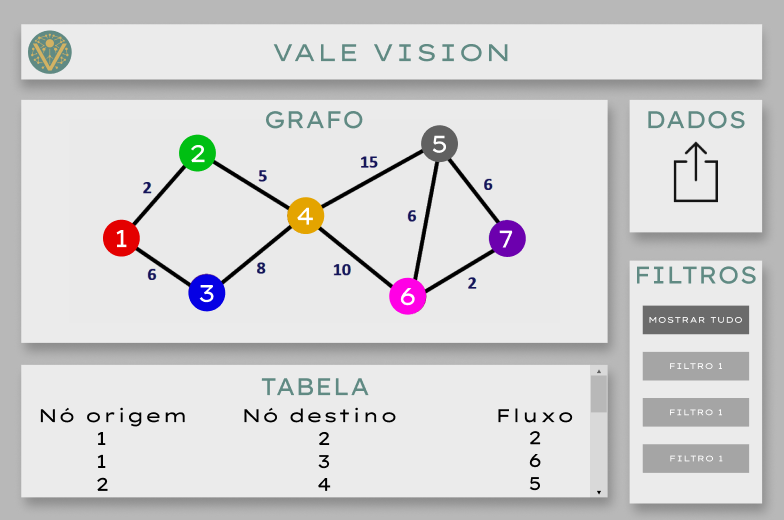

# Front-End

## Mockup

&emsp;&emsp;Um mockup é uma representação visual de alta fidelidade de um produto ou página web, que demonstra como o design irá aparecer e funcionar na vida real, antes de ser completamente construído ou codificado. Ao contrário dos wireframes, que são mais focados na estrutura e no layout, os mockups oferecem uma visão detalhada do produto, incluindo escolhas de cores, tipografia, imagens, e até mesmo efeitos visuais e de interface. Eles são uma ferramenta crucial na etapa de design do desenvolvimento de projetos, especialmente para aplicações web.

Figura 1 - Mockup

Fonte: Material produzido pelos autores (2024)

### Explicação do mockup

#### Área GRAFO

&emsp;&emsp;A Área do Grafo é o ponto focal onde o grafo é exibido. Aqui, os usuários podem visualizar a estrutura de dados complexa de maneira intuitiva, com nós e arestas ilustrando as relações e conexões entre diferentes pontos de dados. Cada nó é um ponto de dados único, e as arestas representam a relação ou o fluxo entre eles, com os números ao longo das arestas indicando a magnitude desse fluxo.

#### Área DADOS

&emsp;&emsp;A Área de Dados serve como o ponto de entrada para os dados que compõem o grafo. Aqui, os usuários podem fazer o upload de arquivos que contêm os dados a serem analisados. Uma vez que um arquivo é carregado, o algoritmo de fluxo máximo processa os dados e representa uma possível solução na Área do Grafo, transformando números e relações abstratas em uma representação visual clara e compreensível.

#### Área TABELA

&emsp;&emsp;Na Área da Tabela, os detalhes dos dados são apresentados em um formato tabular, proporcionando uma visão detalhada das conexões individuais entre os nós. Cada linha da tabela corresponde a uma aresta no grafo, detalhando o nó de origem, o nó de destino e o valor do fluxo entre eles. 

#### Área FILTROS

&emsp;&emsp;A Área dos Filtros fornece ferramentas para refinar e personalizar a visualização do grafo. Os usuários podem aplicar filtros para isolar certos nós, conexões ou fluxos, facilitando o foco em partes específicas do grafo que são de particular interesse ou relevância para a análise em questão. 
